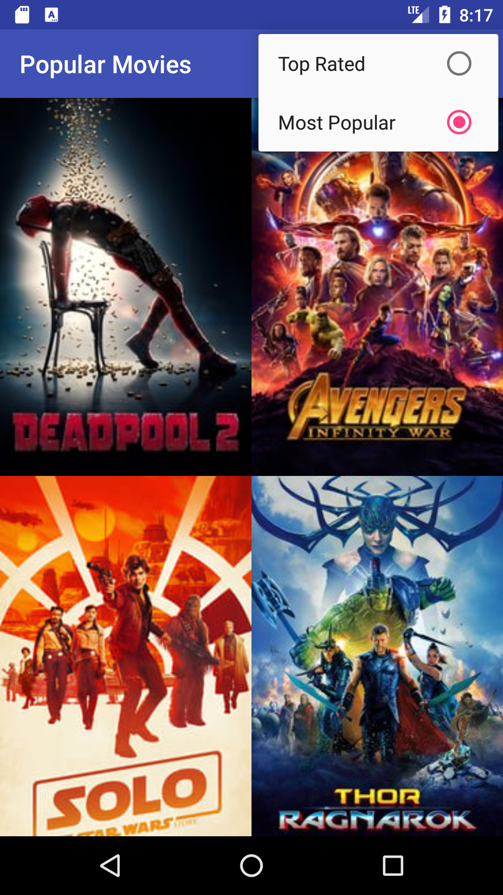
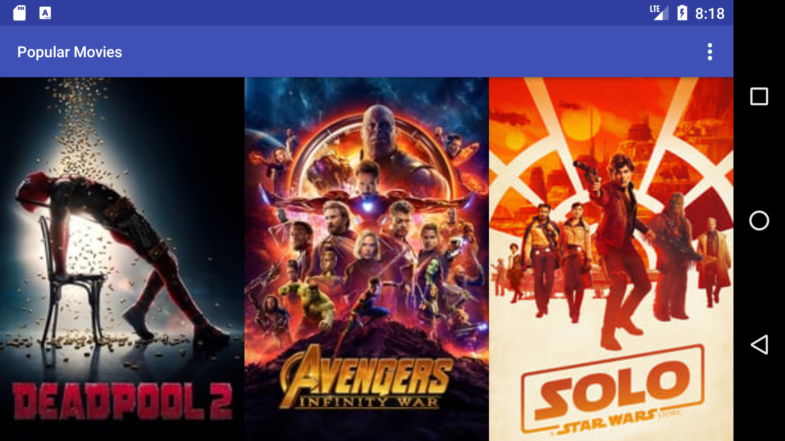
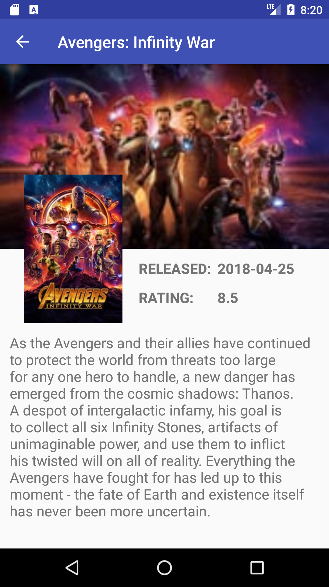

# PopularMovies
This app allows users to discover the most popular movies playing.

## Project Overview
This app will:

Present the user with a grid arrangement of movie posters upon launch.
Allow your user to change sort order via a setting:
The sort order can be by most popular or by highest-rated
Allow the user to tap on a movie poster and transition to a details screen with additional information such as:
original title
movie poster image thumbnail
A plot synopsis (called overview in the api)
user rating (called vote_average in the api)
release date

### Note: Please enter your API key in gradle.properties file like
myAPIKEYTheMovieDb = "your_api_key_here"

The app uses API from the themoviedb.org.
If you don’t already have an account, you will need to create one in order to request an API Key.
In your request for a key, state that your usage will be for educational/non-commercial use. You will also need to provide some personal information to complete the request. Once you submit your request, you should receive your key via email shortly after.

